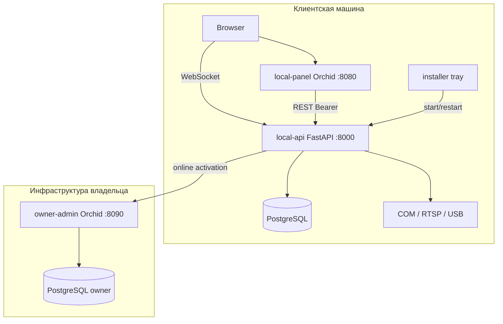
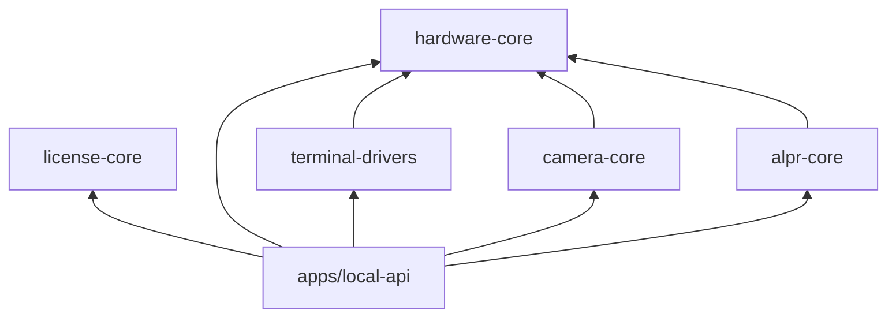
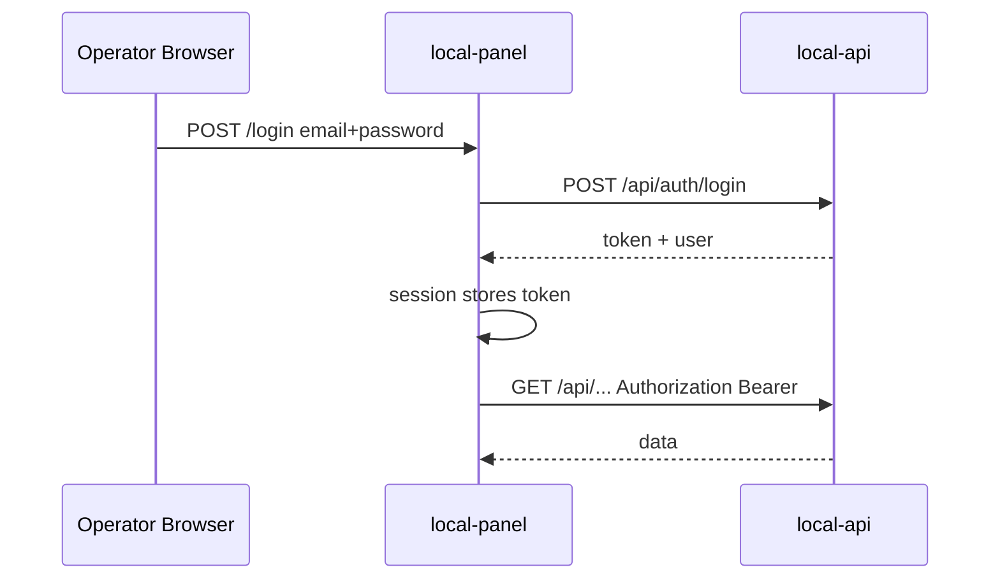
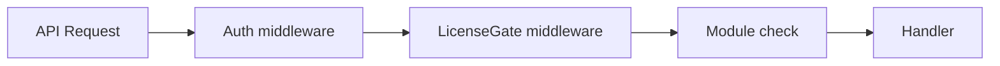

# 02 — Архитектура

## Обзор

Продукт — offline-first система автоматизации взвешивания на автомобильных весах. Три приложения и общие Python-пакеты в монорепо.



---

## Структура монорепо

```
autoscale/
├── apps/
│   ├── owner-admin/          # Laravel 12 + Orchid 14
│   ├── local-api/            # FastAPI + Alembic + SQLAlchemy
│   └── local-panel/        # Laravel 12 + Orchid 14 (stateless)
├── packages/
│   ├── license-core/         # Ed25519, fingerprint, validation
│   ├── hardware-core/        # TerminalDriver, CameraProvider interfaces
│   ├── terminal-drivers/     # Keli, CAS, DEMO
│   ├── camera-core/          # RTSP, HTTP, DEMO
│   ├── alpr-core/            # ALPRProvider, normalization
│   └── shared-contracts/     # openapi.yaml
├── installer/
├── docs/
├── docker-compose.yml
└── pyproject.toml
```

### Граф зависимостей Python-пакетов



---

## ADR-001: Laravel Orchid вместо Filament

**Контекст:** Нужен единый admin-stack для `local-panel` и `owner-admin`.

**Решение:** Laravel 12 + Orchid 14 для обеих панелей.

**Обоснование:**

- asp-autoscale уже валидировал Orchid для этого домена.
- Команда имеет навыки Orchid (screens, layouts, HIG).
- Filament — альтернатива, но вводит второй UI-подход без выгоды для solo dev.
- Orchid + Bootstrap 5 + Blade/jQuery соответствует offline/local admin без SPA-переписывания.

**Последствия:** Screens — thin clients к API; бизнес-логика не в `app/Orchid/Screens/*`.

---

## ADR-002: api-only база данных (локально)

**Контекст:** Где хранить operational data и users на клиентской машине.

**Решение:** Единственный владелец PostgreSQL — `local-api`. `local-panel` stateless.

**Обоснование:**

- Один источник правды, нет sync между Laravel и FastAPI.
- Hardware runtime и FSM живут рядом с данными.
- Panel можно перезапускать без миграций business tables.

**Реализация:**

- Alembic migrations в `apps/local-api`.
- Auth: `users` + Sanctum tokens в local-api.
- Panel: custom `ApiGuard`, session хранит Bearer token.
- Panel не использует Eloquent для business entities — только HTTP client services.

---

## ADR-003: nomeroff-net как production ALPR

**Контекст:** Offline распознавание российских госномеров.

**Решение:**

- Production path: [nomeroff-net](https://github.com/ria-com/nomeroff-net) через `NomeroffNetProvider`.
- MVP default: `DemoAlprProvider` + `MockAlprProvider`.
- nomeroff-net — opt-in extra dependency с отдельной документацией установки моделей.

**Обоснование:**

- Специализация на RU/EU номерах, RU OCR dataset.
- Python pipeline совместим с FastAPI runtime.
- Тяжёлые модели не блокируют MVP demo.

**Последствия:** Модуль `alpr` в лицензии gate-ит автоматическое распознавание.

---

## Слои local-api

```
routers/          # HTTP + WebSocket endpoints, validation, auth
  └── services/   # бизнес-оркестрация (WorkplaceService, LicenseService)
        └── adapters/  # wiring к packages/*
              └── packages/  # чистые интерфейсы и драйверы
```

**Правила:**

- Routers < 15 строк на метод — делегирование в service.
- Services не импортируют FastAPI.
- Packages не знают про HTTP/DB.
- FSM (`WorkplaceOrchestrator`) тестируется с mock drivers.

---

## Auth flow



- `POST /api/auth/login` — email, password → Sanctum token.
- `GET /api/auth/me` — текущий оператор.
- `POST /api/auth/logout` — revoke token.
- Panel Orchid middleware проверяет наличие token в session.

---

## Feature gating



- `LicenseGate` вызывает `license-core.ensure_valid()`.
- Для каждого endpoint — required module(s): e.g. `POST /api/terminals` → `terminals`.
- При invalid license: 403 + `license_status` в body.
- Panel: `GET /api/license/status` при загрузке layout → скрытие/блокировка меню.
- Без лицензии доступны только «Лицензия» и «Диагностика».

---

## WebSocket hub

| Endpoint | События |
|----------|---------|
| `/ws/health` | api, db, license, equipment summary |
| `/ws/terminals/{id}` | frame, weight, stable, raw, error |
| `/ws/cameras/{id}` | snapshot meta, stream status, alpr candidate |
| `/ws/workplaces/{id}` | fsm_state, live weight, plate, actions |

Panel открывает WS напрямую к `local-api` (не через Laravel proxy).

---

## Owner-admin

- Отдельный PostgreSQL.
- Ed25519 **private key** только в env/secret store owner-admin.
- Public key вшит в `license-core` (local-api).
- Orchid screens: Organizations, Client Users, License Modules, Licenses, Activations, Offline Requests.

---

## Безопасность

| Правило | Реализация |
|---------|------------|
| local-api bind | `127.0.0.1` по умолчанию; LAN — явная настройка |
| Секреты камер | Encrypted at rest в DB; не логировать |
| Private signing key | Только owner-admin |
| Audit | `audit_log` для операторских действий и лицензий |
| No master password | Seed только для dev |

---

## Dev-порты

| Сервис | URL |
|--------|-----|
| local-api | http://127.0.0.1:8000 |
| local-panel | http://127.0.0.1:8080 |
| owner-admin | http://127.0.0.1:8090 |
| PostgreSQL local | localhost:5432 |
| PostgreSQL owner | localhost:5433 |

---

## Схема БД (local-api)

| Таблица | Назначение |
|---------|------------|
| `users` | Операторы |
| `personal_access_tokens` | Sanctum tokens |
| `license_state` | Текущая лицензия, anti-rollback |
| `license_audit` | История проверок |
| `terminals` | Настройки терминалов |
| `cameras` | Настройки камер |
| `workplaces` | Рабочие места |
| `workplace_cameras` | M:N камеры на workplace |
| `weighing_records` | Журнал |
| `plate_candidates` | Кандидаты номеров на запись |
| `weighing_snapshots` | Снимки |
| `drivers` | Карточки водителей |
| `vehicles` | ТС (госномер normalized) |
| `equipment_events` | События оборудования |
| `audit_log` | Аудит действий |
| `app_settings` | Глобальные настройки |

Owner-admin: `owner_users`, `organizations`, `client_users`, `license_modules`, `licenses`, `license_module_assignments`, `license_activations`, `offline_activation_requests`, `issued_license_files`, `audit_log`.

---

## Realtime vs REST

| Данные | Канал |
|--------|-------|
| CRUD settings | REST |
| Live weight, FSM | WebSocket |
| License activate | REST |
| Health polling | REST + WS |

---

## Installer (MVP skeleton)

- Windows Service для `local-api`.
- Tray: статус, open panel, restart, open logs folder.
- `support-bundle.ps1` — zip логов + health JSON + redacted config.
- Production Inno Setup — post-MVP; структура в `installer/` готова.
