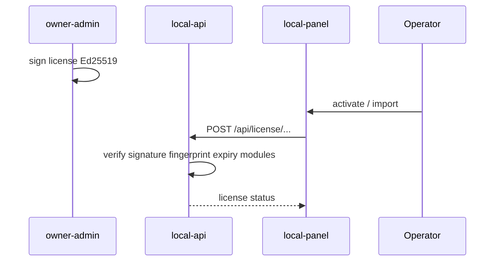
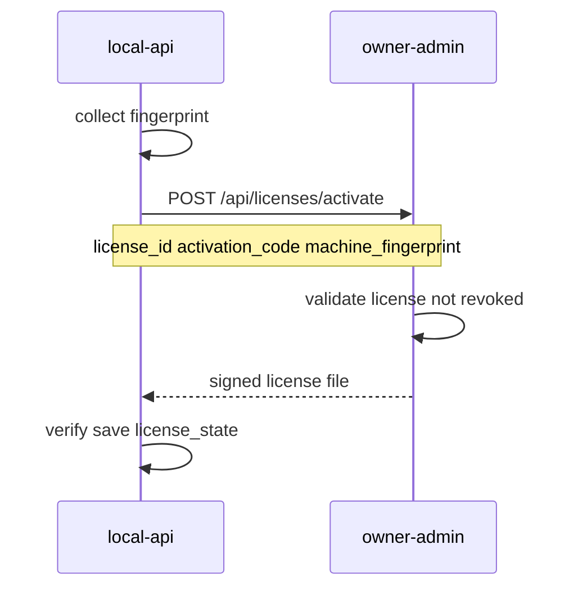

# 03 — Лицензирование

## Принципы

- **Модульная лицензия** — набор features/modules и limits, не жёсткие тарифы basic/pro/full.
- **Offline-first** — подписанный license file работает без интернета.
- **Online activation** — приоритет при наличии сети.
- **Machine binding** — лицензия привязана к fingerprint установки.
- **Centralized validation** — вся проверка через `packages/license-core`.

---

## Участники



---

## Модули MVP

| Module key | Описание |
|------------|----------|
| `core` | Базовый запуск, health, диагностика |
| `terminals` | Управление весовыми терминалами |
| `cameras` | Подключение камер |
| `alpr` | Автоматическое распознавание номеров |
| `weighing_journal` | Журнал взвешиваний |
| `drivers_registry` | Справочник водителей/ТС |
| `workplaces` | Рабочие места |
| `reports_basic` | Базовые отчёты (flag; UI минимален в MVP) |
| `api_access` | REST API для интеграций |
| `multi_workplace` | Более одного активного workplace |

`core` обязателен всегда. Без модуля — endpoint и UI раздел блокируются.

---

## Лимиты

| Limit key | Тип | Описание |
|-----------|-----|----------|
| `max_users` | int | Максимум операторов |
| `max_workplaces` | int | Рабочие места |
| `max_terminals` | int | Терминалы |
| `max_cameras` | int | Камеры |
| `max_records_per_month` | int | Записей журнала в месяц (0 = без лимита) |
| `expires_at` | ISO datetime | Срок действия |
| `grace_days` | int | Дней после expires_at с ограниченным доступом |
| `offline_until` | ISO datetime | До когда valid без online check |
| `allowed_modules` | string[] | Список модулей |

Enforcement в local-api при create/start операций.

---

## Формат license file

Подписанный JSON (canonical serialization перед подписью):

```json
{
  "format_version": 1,
  "license_id": "uuid",
  "client_id": "uuid",
  "organization_name": "ООО Пример",
  "modules": ["core", "terminals", "cameras", "alpr", "workplaces", "weighing_journal", "drivers_registry"],
  "limits": {
    "max_users": 5,
    "max_workplaces": 2,
    "max_terminals": 4,
    "max_cameras": 8,
    "max_records_per_month": 10000
  },
  "expires_at": "2027-12-31T23:59:59Z",
  "grace_days": 14,
  "offline_until": "2027-06-30T23:59:59Z",
  "machine_fingerprint": "sha256:...",
  "issued_at": "2026-06-29T12:00:00Z",
  "status": "active"
}
```

Файл на диске:

```json
{
  "payload": { ... },
  "signature": "base64-ed25519-signature"
}
```

- **Алгоритм:** Ed25519.
- **Private key:** только `owner-admin` (`LICENSE_SIGNING_PRIVATE_KEY`).
- **Public key:** встроен в `license-core` (`LICENSE_PUBLIC_KEY`).
- Ручное редактирование payload ломает подпись.

---

## Machine fingerprint

Стабильный хеш из компонентов (platform-specific):

- Windows: machine GUID, disk serial (если доступен), hostname salt.
- Linux/macOS dev: hostname + machine-id.

Формат: `sha256:<hex>`.

Хранится в license file и сравнивается при каждой проверке.

### Rebind

- При mismatch → status `machine_mismatch`, блокировка.
- Owner-admin: action «Rebind» — новый fingerprint, re-issue license file.

---

## Статусы лицензии

| Status | Доступ | Описание |
|--------|--------|----------|
| `active` | Полный по modules | В срок, fingerprint OK |
| `grace` | Полный + warning | После `expires_at`, в пределах `grace_days` |
| `offline_valid` | Полный offline | Нет сети, в пределах `offline_until` |
| `expired` | Блок (кроме License/Diagnostics) | Срок и grace истекли |
| `suspended` | Блок | Приостановлена владельцем |
| `revoked` | Блок | Отозвана |
| `machine_mismatch` | Блок | Fingerprint не совпадает |

---

## Online activation



**Request:**

```json
{
  "license_id": "uuid",
  "activation_code": "XXXX-XXXX",
  "machine_fingerprint": "sha256:..."
}
```

**Response:** signed license file (тот же формат, что offline).

При успехе local-api сохраняет файл в защищённое хранилище и обновляет `license_state`.

---

## Offline activation

### Шаг 1 — Activation request (на клиенте)

`POST /api/license/offline/request` → файл:

```json
{
  "format_version": 1,
  "request_id": "uuid",
  "machine_fingerprint": "sha256:...",
  "product_version": "0.1.0",
  "requested_at": "2026-06-29T12:00:00Z",
  "hostname": "scale-pc-01"
}
```

Оператор переносит файл владельцу продукта.

### Шаг 2 — Issue (owner-admin)

Владелец загружает request, выбирает лицензию, генерирует signed license file.

`POST /api/licenses/offline/issue`

### Шаг 3 — Import (на клиенте)

`POST /api/license/offline/import` — panel загружает файл → local-api verify + save.

---

## Anti-rollback

Защита от отката системного времени:

| Поле | Назначение |
|------|------------|
| `last_validated_at` | Последняя успешная проверка (UTC) |
| `monotonic_counter` | Инкремент при каждой валидации |
| `last_seen_utc` | Максимальное «виденное» время |

**Правила:**

- Если `now < last_validated_at - skew_tolerance` → suspicious, status degraded.
- Store в защищённом файле: Windows DPAPI, dev — encrypted JSON в data dir.

---

## Online revocation check

- Периодический фоновый job (config: `LICENSE_ONLINE_CHECK_HOURS`, default 24).
- `GET owner-admin/api/licenses/{id}/status` или batch endpoint.
- При `revoked` / `suspended` → local block даже при наличии старого файла.
- Без сети — работа в пределах `offline_until`.

---

## Owner-admin: возможности владельца

- CRUD организаций (клиентов)
- CRUD пользователей клиента
- CRUD модулей лицензии (справочник)
- CRUD лицензий с modules + limits + срок
- Назначение лицензий организациям/пользователям
- `issue` / `revoke` / `suspend` / `renew`
- Генерация offline license file
- Просмотр истории активаций
- Machine fingerprint активированной лицензии
- Rebind при замене ПК

---

## UI local-panel (раздел «Лицензия»)

- Текущий status + user_message
- Активные modules и limits
- Online activation form
- Import offline license file
- Generate activation request + download
- Copy machine fingerprint
- Последнее успешное обновление / ошибки

При блокировке: рабочие разделы недоступны, License и Diagnostics — доступны.

---

## Audit

События в `audit_log` (local и owner):

- activation success/fail
- import license
- revoke/suspend/renew
- module denied (API 403)
- rebind

Без логирования паролей и camera credentials.
