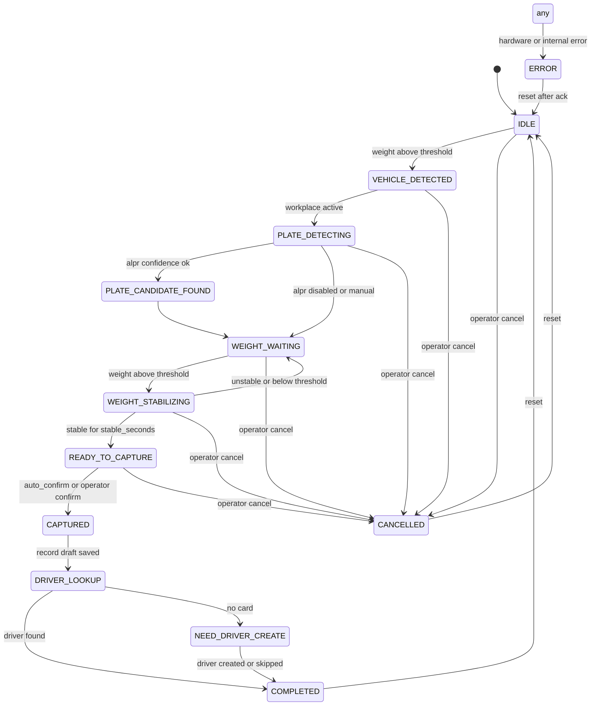
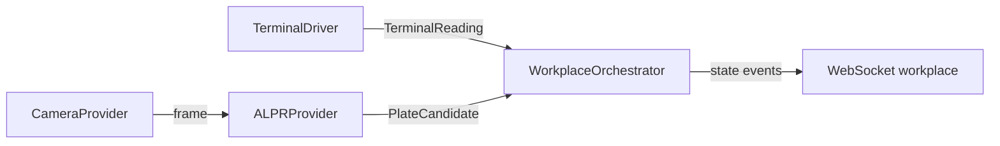

# 04 — Workflow взвешивания

## Обзор

Взвешивание управляется явной **state machine** в `WorkplaceOrchestrator` (`apps/local-api`). FSM не смешивается с hardware I/O: терминал и камера поставляют события, orchestrator решает переходы.



---

## Состояния

| State | Описание |
|-------|----------|
| `IDLE` | Рабочее место активно, ожидание ТС |
| `VEHICLE_DETECTED` | Вес выше `min_weight_threshold` |
| `PLATE_DETECTING` | Камера собирает plate candidates |
| `PLATE_CANDIDATE_FOUND` | Есть кандидат с достаточным confidence |
| `WEIGHT_WAITING` | Ожидание стабильного веса |
| `WEIGHT_STABILIZING` | Вес в процессе стабилизации |
| `READY_TO_CAPTURE` | Условия фиксации выполнены |
| `CAPTURED` | Снимок данных сохранён |
| `DRIVER_LOOKUP` | Поиск карточки по номеру |
| `NEED_DRIVER_CREATE` | Карточка не найдена |
| `COMPLETED` | Цикл завершён |
| `CANCELLED` | Отменено оператором |
| `ERROR` | Ошибка оборудования или логики |

---

## Параллельные потоки

Пока workplace **started**:

1. **Terminal runtime** — непрерывно `read_frame()` → WS `/ws/terminals/{id}`.
2. **Camera runtime** — ingest кадров → ALPR (если licensed) → plate candidates.
3. **Orchestrator** — на каждом tick/event оценивает переходы FSM.



---

## Настройки workplace

| Поле | Тип | Описание |
|------|-----|----------|
| `name` | string | Название |
| `terminal_id` | FK | Терминал |
| `camera_ids` | FK[] | Одна или несколько камер |
| `alpr_provider` | enum | demo / mock / nomeroff |
| `min_weight_threshold` | decimal | Мин. вес для детекции ТС |
| `stable_seconds` | float | Секунд стабильности |
| `max_weight_delta` | decimal | Макс. отклонение в окне стабильности |
| `auto_confirm` | bool | Автофиксация без кнопки |
| `manual_confirm` | bool | Требовать подтверждение оператора |
| `snapshot_policy` | enum | on_capture / on_stable / both |
| `duplicate_protection_window_sec` | int | Окно защиты от дублей |
| `enabled` | bool | Включено |

---

## Условия фиксации веса

Вес фиксируется только если **все** условия:

1. `weight >= min_weight_threshold`
2. Стабильность: `terminal.stable == true` **или** алгоритм delta-window (`max_weight_delta` за `stable_seconds`)
3. Стабильность держится не менее `stable_seconds`
4. Номер: confidence ≥ порога **или** оператор разрешил вручную без номера (`manual_confirm` + explicit override)

---

## Данные при фиксации (CAPTURED)

| Поле | Источник |
|------|----------|
| `best_plate_raw` / `best_plate_normalized` | Лучший PlateCandidate |
| `plate_alternatives` | JSON список кандидатов |
| `weight` / `unit` | TerminalReading |
| `stable` | bool |
| `terminal_raw` | raw frame string |
| `snapshots` | images per camera |
| `workflow_state` | state на момент capture |
| `operator_id` | текущий user |
| `workplace_id` | FK |
| `confidence` | ALPR confidence |
| `driver_id` / `vehicle_id` | nullable, после lookup |

---

## DRIVER_LOOKUP

1. Нормализация номера (см. docs/05-hardware-drivers.md).
2. Поиск `vehicles.plate_normalized`.
3. Найден → привязка `driver_id`, status → `COMPLETED`.
4. Не найден → `NEED_DRIVER_CREATE`, запись в статусе `draft`.

UI workplace: кнопка «Создать карточку водителя» → форма с предзаполненным номером.

---

## Duplicate protection

Если в пределах `duplicate_protection_window_sec` уже есть запись с:

- тем же `plate_normalized` (или оба null при ручном режиме)
- тем же `weight` (± discretization)
- тем же `workplace_id`

→ не создавать автоматически; показать оператору предупреждение и требовать explicit confirm.

---

## Ручные действия оператора

| Действие | API | Из состояний |
|----------|-----|--------------|
| Начать вручную | `POST /api/workplaces/{id}/start` | IDLE |
| Подтвердить | `POST /api/weighings/{id}/confirm` | READY_TO_CAPTURE |
| Отменить | `POST /api/weighings/{id}/cancel` | * (кроме COMPLETED) |
| Сбросить | `POST /api/workplaces/{id}/stop` + start | * |
| Создать водителя | `POST /api/drivers` | NEED_DRIVER_CREATE |

---

## WeighingContext

Immutable snapshot для тестов и capture:

```python
@dataclass(frozen=True)
class WeighingContext:
    workplace_id: UUID
    state: WeighingState
    weight_readings: tuple[TerminalReading, ...]  # ring buffer
    plate_candidates: tuple[PlateCandidate, ...]
    best_plate: PlateCandidate | None
    terminal_raw: str | None
    snapshots: tuple[SnapshotRef, ...]
    started_at: datetime
    updated_at: datetime
```

FSM unit tests: inject mock `TerminalDriver` + `ALPRProvider`, step events, assert state transitions.

---

## WebSocket events (workplace)

```json
{
  "type": "state_changed",
  "state": "WEIGHT_STABILIZING",
  "previous_state": "WEIGHT_WAITING",
  "weight": 15230.0,
  "unit": "kg",
  "stable": false,
  "plate_candidate": { "raw": "A123BC77", "normalized": "A123BC77", "confidence": 0.92 },
  "timestamp": "2026-06-29T12:00:00Z"
}
```

Типы: `state_changed`, `weight_update`, `plate_update`, `capture_ready`, `error`, `completed`.

---

## Запись в журнале

| Поле журнала | Описание |
|--------------|----------|
| `recorded_at` | UTC |
| `workplace_id` | Рабочее место |
| `plate_raw` / `plate_normalized` | Номер |
| `driver_id` | Карточка |
| `weight` / `unit` | Вес |
| `stable` | Стабильность |
| `terminal_id` / `camera_id` | Оборудование |
| `confidence` | ALPR |
| `status` | completed / draft / cancelled |
| `operator_id` | Оператор |
| `terminal_raw` | Сырой кадр |
| `notes` | Ошибки/заметки |

---

## DEMO scenario

1. Start workplace «Demo Lane».
2. DEMO terminal ramp weight 0 → 15000 kg, stable=true.
3. DemoAlprProvider returns `A123BC77` confidence 0.95.
4. FSM auto-transitions to READY_TO_CAPTURE → CAPTURED.
5. No driver card → NEED_DRIVER_CREATE.
6. Operator creates driver → COMPLETED.

Время полного цикла в demo: ~10–15 секунд (configurable DEMO ramp).
